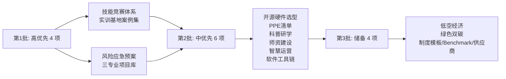

# 逐项补充规划（基于广泛资源调研）

> 本文是知识库「覆盖度分析与补充路线图」的**落地执行规划**。已按你建议的路径——**先广泛调研可用资源**——对 15 项内容缺口逐一完成资源扫描，形成每项的：调研发现 → 可落地内容 → 首选来源 → 补充路径。
> 调研日期：2026-08-30 ｜ 状态约定：🔴高优先 / 🟠中优先 / 🟡储备

---

## 〇、调研方法说明

- 来源类型：官方政策（教育部/人社部/应急管理部/民航局）、政府采购与中标公示（真实设备与价格）、公开案例报道（院校官网/教育部门）、开源社区（GitHub/软件官网）、专业机构（NVIDIA/Fab 官方等）。
- 所有外部资源均保留原始链接，便于后续核验与引用。
- 落地时遵循知识库新增文档四步规范（frontmatter → README 登记 → GLOSSARY 补术语 → 更新日志登记）。

---

## 一、🔴 高优先项（4 项）

### 1.1 三专业技能竞赛体系

**调研发现**：
- 竞赛体系是职业院校的硬 KPI，且已有清晰的公开赛项目录可参考。
- 教育部职业院校技能大赛已重构为「世界职业院校技能大赛」——设 **42 个赛道、109 个赛项**，覆盖装备制造、电子与信息、医药卫生等大类；2026 年为第二届。
- 人社部全国技能大赛设 **106 个竞赛项目**，制造业赛项密集（数控、机器人系统集成、增材制造、电子技术、网络安全等）。
- 与三专业强相关赛项（示例）：智能制造领域（工业机器人系统集成、智能产线）、AI 领域（人工智能工程技术、网络安全）、新能源汽车领域（汽车技术、新能源汽车智能化技术）。
- 世界技能大赛中国正全力冲金（2026 上海世界技能大赛为东道主），焊接、增材制造、移动机器人等是强项。

**可落地内容**：
1. 三专业赛项目录表（赛项名 / 主办层级 / 周期 / 对应专业 / 训练要点）
2. 备赛组织方法（梯队选拔、训练计划、设备需求、经费预算）
3. 以赛促建：赛项设备 ↔ 实训室设备的复用映射

**首选来源**：
- 教育部《世界职业院校技能大赛》官方信息
- 人社部《中华人民共和国职业技能大赛》赛项目录
- 世界技能大赛官网（2026 上海世赛）

**补充路径**：新增 `04-运营与管理/技能竞赛体系-三专业赛项与备赛.md`

---

### 1.2 职业院校实训基地案例集

**调研发现**（真实公开案例，已核验）：
- **山东外事职业大学**：投入超 8000 万建数字科技/低空/人工智能全链条实训体系，获"好客山东·见识齐鲁"官方研学点位，承接中小学研学 10 余批次、服务 3000+ 人次；四大研学路线（数字元宇宙/低空航空/AI/红色文化）。
- **许昌（前述实训基地专项）**、**重庆科创职业学院**、**柳州（新能源汽车/智能制造职教集群）**、**东营（胜利油田产教融合）**、**济南（智能制造装备）** 等区域案例（已在治理文档提及，待深化）。
- **贵阳学院「齿轮创客空间」**：科普实训基地常态化对接中小学，2025 全国科普月"大手拉小手"。
- **南京机电职业技术学院**：高校星火馆 "1 个航天科普场馆 + 2 个主题展馆 + 10 个产教融合平台"三级架构，服务 3000+ 人次中小学生。
- 典型模式提炼：① 高校/职校实训资源向中小学开放的"第二课堂"；② 产教融合共同体的"三组长"机制；③ 区域特色产业学院（低空、新能源、绿色制造）。

**可落地内容**：
1. 10-20 个真实案例卡片（院校名 / 规模投入 / 模式 / 特色 / 可借鉴点 / 来源链接）
2. 案例模式归类与适用场景映射
3. 从案例中提炼"可复制的建设路径"

**首选来源**：
- 山东外事职业大学案例（大众日报报道）
- 贵阳学院齿轮创客空间案例（中国网高校频道）
- 南京机电职业技术学院星火馆案例（江苏教育厅报道）
- 各院校官网公开信息

**补充路径**：扩展 `05-案例研究/`（新建 `职业院校实训基地案例集.md`）

---

### 1.3 风险与应急预案专项

**调研发现**：
- 职业院校实训室安全已高度规范化，且**有官方配备标准可依**。
- 应急管理部《熔化焊接与热切割作业安全技术实际操作考试点设备配备标准》：给出完整 PPE 配备清单（长袖工作服/皮手套/帆布手套/手提+头戴面罩/滤光片/透明护头面罩等）——这是焊接类实训的权威 PPE 基线。
- 焊接风险图谱（官方安全指引）：手工电弧焊→触电；二保焊密闭空间→CO 中毒；氩弧焊→放射性粉尘（钍钨极，优先铈钨极）；点焊→夹手截指。
- 激光焊接安全：滤激光波长护目镜（防永久失明）、防尘口罩、隔热手套"焊接三件套"、安全地锁回路。
- 多所职业院校公开实训室安全管理制度/应急预案（如辽宁建筑职院实训室安全管理系统：准入培训考核发证一体化、危险源及防护装备管理、应急预案及演练、三级责任书签署、风险评估）。
- 宿舍楼内高价值设备（激光/CNC/焊接）场景需专项预案。

**可落地内容**：
1. 实训室风险矩阵（风险源 / 风险等级 / 控制措施 / 应急响应）
2. 分设备安全 SOP（激光切割/CNC/焊接/3D 打印/锂电池）
3. PPE 采购清单（分设备场景，含官方标准型号参考）
4. 应急预案模板（火灾/触电/机械伤害/化学泄漏/锂电池热失控）+ 演练计划
5. 责任体系（三级责任书）+ 安全准入（培训→考核→发证）

**首选来源**：
- 应急管理部焊接考试点配备标准（PDF，mem.gov.cn）
- 焊接/激光焊接官方安全指引
- 职业院校公开安全管理制度模板

**补充路径**：新增 `04-运营与管理/实训室安全与应急预案.md`（或拆分为 安全SOP + 应急预案 两篇）

---

### 1.4 三专业典型实训项目库

**调研发现**：
- 教育部 2026《职业教育专业目录》增补 **27 个新专业**：人形机器人工程技术、具身智能计算技术、低空运输工程技术、智能无损检测等——为三专业项目设计提供方向指引。
- 教育部《深化职业教育教学关键要素改革的意见》（教职成〔2026〕1号）：要求绘制"课程能力图谱"，强调项目化、模块化教学。
- 三专业方向的项目素材可从以下提炼：
  - 智能制造：工业机器人系统集成（真实中标设备：越疆 DT-CR050A 协作机器人工作站、埃夫特、广州数控 RB08Q1）、数字孪生（T/CAMETA 标准）、智能产线
  - AI/具身：Jetson 边缘 AI（NVIDIA 官方教育生态）、机器狗、机器视觉、人形机器人（越疆 DT-AT-035 人形机器人实例）
  - 新能源汽车：动力电池台架、电机台架、高压安全、智能网联
- 项目设计可对标"1+X 证书"模块与"岗课赛证"融合要求。

**可落地内容**：
1. 每专业 10-20 个典型实训项目卡（项目名 / 目标技能 / 设备需求 / 课时 / 考核点 / 对接证书或赛项）
2. 项目阶梯（基础→综合→创新）
3. 项目 ↔ 设备 ↔ 赛项 ↔ 证书 四维映射表

**首选来源**：
- 教育部 2026 职业教育专业目录增补（27 专业）
- 教职成〔2026〕1号《深化职业教育教学关键要素改革的意见》
- 真实设备中标数据（政府采购公示，作为设备配置依据）
- NVIDIA Jetson 教育生态 / 各设备厂商课程资源

**补充路径**：新增 `04-运营与管理/教育专题/三专业典型实训项目库.md`（可分智能制造/AI/新能源三篇）

---

## 二、🟠 中优先项（6 项）

### 2.1 开源硬件与 AI 开发套件选型

**调研发现**（2026 主流边缘 AI 板卡实测对比）：
- **Jetson Orin Nano Super**：67 TOPS，$249，NVIDIA 官方教育主推，生成式 AI/机器人/视觉全场景，生态最成熟（JetPack/Isaac ROS）。入门首选。
- **树莓派 5**：CPU 强、无 NPU，无法跑深度学习推理，但 Linux 学习/GPIO/初学者最佳，社区最成熟。定位"入门 + 通用"。
- **香橙派 5（RK3588S）**：三核 NPU，性能高于树莓派，支持 OpenCV/YOLO，价格中端（¥700-800），但生态弱、资料少。
- **嘉立创庐山派（K230）**：RISC-V + NPU，¥228，性价比高，适合预算有限。
- **MaixCAM**：1GHz RISC-V + 1TOPS NPU，可跑 YOLO，触摸屏脱机调参，¥200 级。
- 机器人方向：**VENTUNO Q**（Pi5+HAT）侧重 AI+实时控制+机器人接口。
- 结论建议：教学主平台 = Jetson Orin Nano Super（AI/机器人方向）；入门/通用 = 树莓派5；预算敏感 = 庐山派/K230 或 MaixCAM；形成"高-中-低"三档选型。

**可落地内容**：开源硬件选型指南（档次 / 型号 / 算力 / 价格 / 适用课程 / 采购建议 / 参考来源）

**首选来源**：
- NVIDIA Jetson 官方（教育生态、AI Lab 教程）
- 2026 主流板卡实测评测
- 各板卡官网规格

**补充路径**：扩展 `03-设备与工具/设备清单与选型.md` 或新增 `开源硬件与AI开发套件选型.md`

---

### 2.2 PPE 与安全防护设备采购清单

**调研发现**：
- 应急管理部焊接考试点 PPE 配备标准（含具体设备型号规格）为焊接类基线。
- 各场景 PPE 已有明确规范（见 1.3）：焊接（阻燃服/变光面罩/耐高温手套/劳保鞋/防毒口罩）、激光（滤激光波长护目镜/防尘口罩/隔热手套）、打磨切割（护目镜/面屏/防尘口罩）、木工（护目镜/防切割手套）、电子（防静电腕带/护目镜）。
- GB/T 12903《个体防护装备术语》、GB/T 11651《个体防护装备选用规范》为选用标准依据。

**可落地内容**：分场景 PPE 采购清单（场景 / PPE 项 / 标准依据 / 数量建议 / 更换周期）

**首选来源**：应急管理部标准 PDF、GB/T 12903、GB/T 11651、行业安全指引

**补充路径**：并入 1.3 应急预案专项 或 独立 `03-设备与工具/PPE安全防护采购清单.md`

---

### 2.3 对外服务与科普研学运营

**调研发现**（政策窗口极佳）：
- **教育部等十八部门《关于加强新时代中小学科学教育工作的意见》**（2023）：课后服务将科学教育设为必备项目；校领导任科学副校长、设科技辅导员、结对科普机构；"请进来/走出去"双向互动。
- **教育部等七部门《关于加强中小学科技教育的意见》**（2025-11）：进一步强化学段贯通、实践基地建设。
- **教育部《中小学科学教育工作指南》**（2025-01）：科学教育纳入课后服务、实验操作纳入综合素质评价。
- **各地跟进**：柳州市《中小学科技教育实施方案(2026-2030)》要求"每周一天科技类课后服务日"；福建省十四部门二十条措施。
- 实践案例：山东外事职大（研学 3000+人次）、贵阳学院齿轮创客空间、南京机电星火馆（服务3000+人次）、四川轻化工三下乡（乡村中小学科普实践）。
- **双师课堂**（科学家+教师）、研学课程分学段设计（小学趣味感知/中学实操探索）是成熟模式。

**可落地内容**：
1. 科普研学运营方案（目标客群 / 课程设计 / 定价模式 / 师资 / 安全管理 / 合规）
2. 课后服务合作模板（与中小学结对、收费、安全责任）
3. 研学路线设计（结合三专业实训区）

**首选来源**：教育部 2023/2025 政策、山东外事职大案例、南京机电星火馆案例、柳州方案

**补充路径**：新增 `04-运营与管理/对外服务与科普研学运营.md`

---

### 2.4 师资队伍建设专项

**调研发现**（政策体系完整）：
- **教育部 财政部《职业院校教师素质提高计划（2021-2025）》**（教师函〔2021〕6号）：中央财政年均 7.9 亿；四级培训体系（国家示范引领/省级统筹/市县联动/校本研修）。
- **《职业教育教师企业实践项目开发与实施指南》**（2025-12 发布）：教师企业实践标准化——目标明确、岗位清晰、路径规范、项目可选、评价多元；破解"一阵风、走过场、两张皮"。
- **双师型认定**：教育部制定认定标准；全国已建 **170 家国家级"双师型"教师培训基地**。
- **职教国培示范项目**：聚焦集成电路、人工智能等紧缺领域（2024 起）。
- **产业导师制度**：校企双向流动、企业技术能手教师资格认定绿色通道、任教与待遇晋升挂钩（2026 两会建议获响应）。
- 实践案例：菏泽职业学院"筑基-赋能-领航"三阶路径（421 人通过省级双师认定）；深圳职大"灯塔工程"+教师教学档案袋。
- 教师每年至少 1 个月企业实践（专业课教师）。

**可落地内容**：
1. 师资建设路径（双师认定 → 企业实践 → 产业导师 → 教学能力清单）
2. 培训资源对接（职教国培、170 家双师基地、企业实践基地名录获取方式）
3. 创客空间专属师资方案（运营者 = 创客导师的多重角色）

**首选来源**：教师函〔2021〕6号、2025 企业实践指南、职教国培项目、菏泽/深职案例

**补充路径**：新增 `04-运营与管理/师资队伍建设专项.md`

---

### 2.5 数据驱动的智慧运营

**调研发现**：
- 智慧实训室平台已成熟，分四类：
  - **开源/自研**：Spring Boot+Vue 架构（可视化预约/RFID/智能排课/安全监控），Redis 防超订；开源 LMS、OpenLIMS（ISO 17025）
  - **商业**：锐捷智慧实验室（¥20万起）、华瑞 LIMS（¥8-15万）、蓝凌实验室云（SaaS ¥60/座/月）
  - **云服务**：腾讯微瓴、阿里云 IoT（AI 识别+传感器联动）
  - **智能空间平台**：噢易智慧实验室（门禁/电源/课表联动、数据看板）、艾拉智慧空间、美程 IC 空间（AI 安全报警）
- 功能闭环：预约→门禁联动→签到→数据统计→利用率热力图；爽约扣分/黑名单；能耗监测。
- 案例：天津现代职院 35 间实训室智慧化；电子科技大学实验室预约系统（利用率提升 55%、管理员工作量降 48%）。
- 教育部实训室安全上报系统要求数据自动采集（辽宁建筑职院案例展示了完整模块）。

**可落地内容**：
1. 智慧运营需求清单与选型矩阵（开源自研 vs 商业 vs SaaS）
2. 数据指标体系（利用率/预约量/设备故障率/能耗）
3. 实施路径（基础门禁预约 → 数据看板 → AI 预警）
4. 关键数据埋点设计

**首选来源**：噢易云、艾拉、开源 LMS（GitHub）、电子科大案例论文、辽宁建筑职院公告

**补充路径**：新增 `04-运营与管理/数据驱动的智慧运营.md`

---

### 2.6 开源软件工具链清单

**调研发现**：
- **Awesome FOSS for Decentralised Manufacturing**（GitHub，全链开源清单）：CAD（FreeCAD/SolveSpace/CadQuery）、CAM（切片/CNC/激光路径）、固件（3D 打印机/CNC/激光）、CAE（FEA/CFD）、机器学习制造、开源硬件设计库——几乎覆盖数字制造全链条。
- **FreeCAD 1.1.1**（2026-07）：参数化 3D CAD，LGPL-2.1，FEM/BIM/CAM 工作台，商业可用。
- **Cura / PrusaSlicer / Slic3r**：开源切片三件套。
- **KiCad**：开源 EDA（PCB 设计）。
- **Blender**：3D 建模/动画全流程。
- **Inkscape**：SVG 矢量（激光切割/CNC 2D 路径）。
- Linux 全流程方案：FreeCAD（建模）→ Cura（切片）→ 打印，全程开源。

**可落地内容**：开源数字制造工具链清单（环节 / 工具 / 许可 / 适用 / 教学价值），构成"零软件成本"创客空间方案

**首选来源**：GitHub awesome-foss-manufacturing、各软件官网、FreeCAD 官方

**补充路径**：扩展 `06-资源索引/` 或 新增 `开源软件工具链清单.md`

---

## 三、🟡 储备项（前沿方向，4 项）

### 3.1 低空经济无人机实训（重大政策风口）

**调研发现**：
- **教育部 2026 一号文件**《深化职业教育教学关键要素改革的意见》（教职成〔2026〕1号）：明确"重点增设低空经济、人工智能、高端装备等领域新专业"。
- 2025 年末《职业教育专业目录增补清单》：新增 57 个专业，其中 **7 个低空经济相关专业**（低空飞行器装备技术 460207、低空安全与技术 510111、低空智联网技术 510311、低空物流技术与运营 530811、低空飞行器工程技术 260204、低空智联网工程 310305 等）。
- 2026-07 教育部再增补 27 专业，含低空运输工程技术（职业本科）。
- 全国实名登记无人机 217.7 万架（+98.5%），持证飞手仅 22.5 万人，行业年紧缺人才约 50 万。
- 教育部规建中心联合工信部发起**低空经济智慧学习工场/产业学院项目**（2026-02 申报开放）。
- 实训室建设标准：室内理论+模拟飞行+装调维修+室内飞行测试+室外综合实训场（**室外严禁设楼顶**，须满足民航局标准）；虚拟仿真系统补足空域限制。
- 真实招标：上海农林职院智能飞行器实训室（最高限价 198.6 万，农业无人机方向）。
- 浙江：29 所技工院校开设无人机类 36 个专业布点、在校生 3227 人。

**可落地内容**：低空经济实训区规划（功能分区/设备配置/空域合规/CAAC 执照衔接/产业学院申报路径）

**首选来源**：教职成〔2026〕1号、教育部专业目录增补、规建中心项目通知、民航局数据、真实招标文件

**补充路径**：扩展 `02-空间搭建/`（新增 `低空经济无人机实训区设计.md`）

### 3.2 绿色双碳制造实训

**调研发现**：
- **2026-07 十九部委《国家应对气候变化"十五五"规划》**：部署低碳国民教育、产教融合创新、双碳人才培育、零碳示范载体。
- **教育部 2022《绿色低碳发展国民教育体系建设实施方案》**：2025 年绿色低碳专业布点≥600 个；组建碳达峰碳中和产教融合联盟。
- **人社部/生态环境部《碳排放管理员国家职业标准》**（2023）：6 大工种 5 等级，职业院校学生可直接申报四级（中级工），考核=理论+实操。
- 全国碳排放管理人才缺口超 70 万人。
- **工信部《工业绿色低碳发展"十五五"规划》**（2026-08）：鼓励高校增设绿色设计/绿色制造/氢能专业，建设产教融合实训基地。
- 案例：广西金融职院双碳产业学院（"低碳技术+绿色金融"）；威海职院绿色低碳（船舶绿色动力、再生水供能）。

**可落地内容**：双碳实训方向（碳排放核算/碳足迹评估/绿色制造/新能源应用），可作远期专业储备

**首选来源**：国家应对气候变化"十五五"规划、教育部绿色低碳方案、碳排放管理员职业标准、广西/威海案例

**补充路径**：储备，待专业方向明确后补充

### 3.3 制度模板文档库 / Benchmark 数据库 / 供应商名录

**调研发现**：
- **制度模板**：职业院校公开的安全管理、绩效评估、双师建设等制度文本可提炼成可填表模板（如菏泽职院管理办法、深职双高方案）。
- **Benchmark 数据**：真实中标数据可构建基准——工业机器人实训台（越疆协作机器人 ¥19 万/套、人形机器人 ¥68 万/台）、智能飞行器实训室（¥198 万）、智能制造产线（栋梁 ¥71 万/套、乌海项目 595 万）等。这些是规划预算与设备选型的真实锚点。
- **供应商名录**：智能制造培训设备厂家（成都英维克、山东栋梁、亚龙智能、华航唯实、埃夫特、越疆、汇博机器人等）+ 招标中标平台（比地招标网、企查查、政府采购网）可作为设备采购来源库。

**可落地内容**：
1. 制度模板文档库（可勾选/填空的 SOP、责任书、评估表）
2. Benchmark 数据库（设备单价/实训室造价/利用率基线，来源=真实中标公示）
3. 供应商与采购渠道名录

**首选来源**：真实政府采购中标公示、企查查/比地招标、院校公开制度

**补充路径**：`06-资源索引/` 新增 `供应商与采购参考名录.md`、`Benchmark数据库.md`；`04-运营与管理/` 新增 `制度模板库.md`

---

## 四、执行顺序建议

**建议节奏**：
- 第 1 批（高优先，对"规划/建设/管理"闭环价值最大）：优先做 1.2 案例集 + 1.1 竞赛体系（外部资源已核验充分，落地快）
- 第 2 批：2.3 科普研学 + 2.4 师资（政策窗口期，宜尽早）
- 第 3 批：按专业方向与预算决策推进

---

## 五、来源链接汇总

> 以下为本次调研中价值最高的原始来源，落地时可直接引用。

**政策类**：
- 教育部《深化职业教育教学关键要素改革的意见》教职成〔2026〕1号：http://www.moe.gov.cn/srcsite/A07/zcs_zhgg/202602/t20260212_1428773.html
- 教育部增补 27 个职业教育新专业（2026-07）：http://www.moe.gov.cn/jyb_xwfb/s5147/202607/t20260717_1444087.html
- 教育部等十八部门《加强新时代中小学科学教育工作的意见》（2023）：http://www.moe.gov.cn/srcsite/A29/202305/t20230529_1061838.html
- 教育部等七部门《加强中小学科技教育的意见》（2025）：https://www.gov.cn/zhengce/zhengceku/202511/content_7048731.htm
- 教育部《中小学科学教育工作指南》（2025）：http://www.news.cn/edu/20250122/b58437e1f4954c7cb6bb6b1431283c6b/c.html
- 教育部 财政部《职业院校教师素质提高计划(2021-2025)》教师函〔2021〕6号：https://hudong.moe.gov.cn/srcsite/A10/s7034/202108/t20210817_551814.html
- 《职业教育教师企业实践项目开发与实施指南》（2025-12）：http://www.moe.gov.cn/jyb_xwfb/gzdt_gzdt/s5987/202512/t20251230_1425247.html
- 教育部规建中心《低空经济智慧学习工场/产业学院项目申报通知》（2026-02）：https://www.csdp.edu.cn/article/10390.html
- 教育部《绿色低碳发展国民教育体系建设实施方案》（2022 政策脉络见擎工互联整理）：https://www.skyco2.com/info/2436.html

**安全/PPE 类**：
- 应急管理部《熔化焊接与热切割作业安全技术实际操作考试点设备配备标准》：http://mem.gov.cn/gk/gwgg/201412/W020171101479169907622.pdf

**案例类**：
- 山东外事职业大学全域开放实训资源（大众日报）：https://dzrb.dzng.com/general/1/DZHN797743XFTCDHGEYR
- 贵阳学院齿轮创客空间科普育人（中国网）：http://gx.china.com.cn/2026-06/09/content_43445280.html
- 南京机电职业技术学院星火馆科普育人（江苏教育厅）：https://yurenhao1.sizhengwang.cn/a/njjdzyjsxy/260629/2470680.shtml
- 菏泽职业学院双师队伍建设（山东教育厅）：http://edu.shandong.gov.cn/art/2026/5/11/art_11972_10346654.html
- 威海职业学院绿色低碳（山东教育厅）：http://edu.shandong.gov.cn/art/2026/7/3/art_11972_10347547.html
- 广西金融职院双碳产业学院：https://mini.gxnews.com.cn/a/21978356

**智慧实训室类**：
- 噢易智慧实验室：https://www.os-easy.com/a/357.html
- 艾拉智慧空间预约平台（高校版）：https://www.alawang.com/space.php
- 辽宁建筑职院实训室安全管理系统需求：https://www.lnjzxy.edu.cn/content/ZZXSPSUP09044N9HWX
- 电子科大低代码实验室预约系统（利用率+55%）：http://www.sy.uestc.edu.cn/cn/article/Y2023/I5/149

**开源硬件/软件类**：
- NVIDIA Jetson Orin Nano Super 开发套件：https://www.nvidia.com/en-us/autonomous-machines/embedded-systems/jetson-orin/
- Awesome FOSS for Decentralised Manufacturing（GitHub）：https://github.com/bruno-dogancic/awesome-foss-manufacturing
- FreeCAD 官方：https://www.freecad.org/?lang=us

**招标/供应商类**：
- 上海农林职院智能飞行器实训室招标（¥198.6万限价）：https://jpg.zfcg.sh.gov.cn/sh-gov-open-doc/1108QZ/5b7b68e8-7f3f-4ba9-a16a-8aa30f29aa1d.pdf
- 广东职院柔性制造协作机器人基地（越疆 ¥593.98万）：https://www.gdpt.edu.cn/a_1/20069
- 梧州职院智能制造单元（广州数控机器人）：https://www.wzzy.edu.cn/info/1121/54381.htm
- 安徽芜湖技师学院智能制造实训基地（栋梁/埃夫特）：https://whsggzy.wuhu.gov.cn/whggzyjy/005/005002/005002003/20260206/cd1e1d73-94ce-4498-af1a-85d00f9eac96.html
- 比地招标网工业机器人中标查询：https://m.bidizhaobiao.com/bidprice/51_4891/

---

## 六、落地时的取舍原则

1. **官方优先**：政策、标准、配备规范以教育部/人社部/应急管理部等官方文件为准。
2. **真实数据锚定**：设备价格、实训室造价用真实中标公示，不臆造。
3. **开源合规**：开源软件/硬件优先（CC/LGPL/GPL 许可），商用需评估授权。
4. **可追溯**：每个数据、案例、标准标注来源链接。
5. **社区共建**：欢迎按「参与共创」机制补充你所在院校/空间的真实案例。
